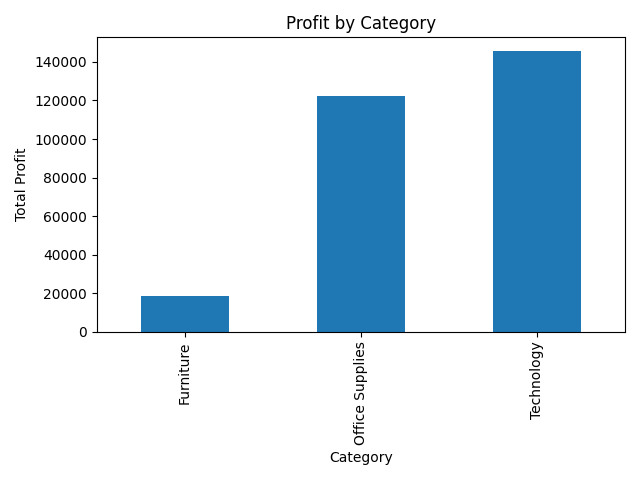
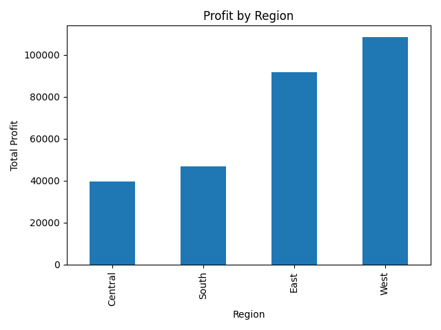
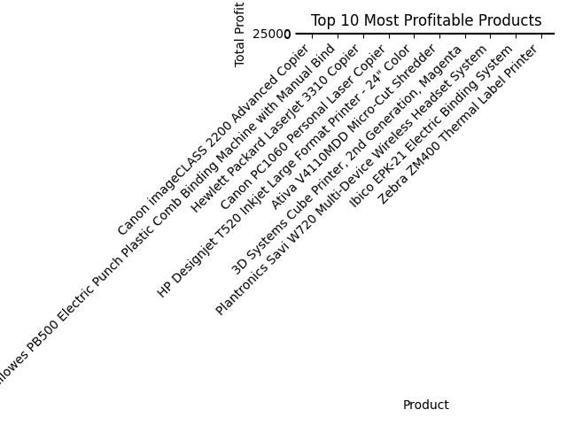

📊 SQL Sales Analysis — Superstore Dataset

📌 Overview

This project is an end-to-end data analysis pipeline built using the Superstore dataset.

It combines Python, SQL (SQLite), Pandas, and Matplotlib to transform raw sales data into actionable business insights.

The objective is to analyze profitability across categories, regions, and products and present results through visual storytelling.

⚙️ Workflow
CSV Dataset → Pandas → SQLite → SQL Queries → Pandas → Visualization → Insights

📊 Business Performance Dashboard
🏷️ Profit by Category (Revenue Drivers)

Insight: Technology is the most profitable category, significantly outperforming others.

🌎 Profit by Region (Geographical Performance)

Insight: The West region leads in profitability, while the Central region underperforms.

🔝 Top 10 Products (Revenue Concentration)

Insight: A small number of products generate a large share of total profit (Pareto principle effect).

🧠 Key Insights Summary
Profit is heavily driven by Technology products
Regional performance is uneven (West dominates)
Revenue is highly concentrated in top-selling products
Furniture shows consistently lower profitability

🚀 What This Project Demonstrates
End-to-end data pipeline (CSV → SQL → Insights)
SQL-based business analysis
Data cleaning and transformation with Python
Data visualization and storytelling
Structured analytical thinking

📁 Project Structure
sql-sales-analysis/
│
├── data/                 # Superstore dataset
├── images/              # Generated visualizations
├── sql/                 # SQL queries
├── main.py              # Main pipeline
├── sales.db            # SQLite database
├── README.md

🚀 How to Run
py main.py

📌 Future Improvements
Time series analysis (sales & profit trends)
Customer segmentation (RFM analysis)
Interactive dashboard (Streamlit / Power BI)
Advanced business KPIs (profit margin, discount impact)

👤 Author

Axel Damian Godardo